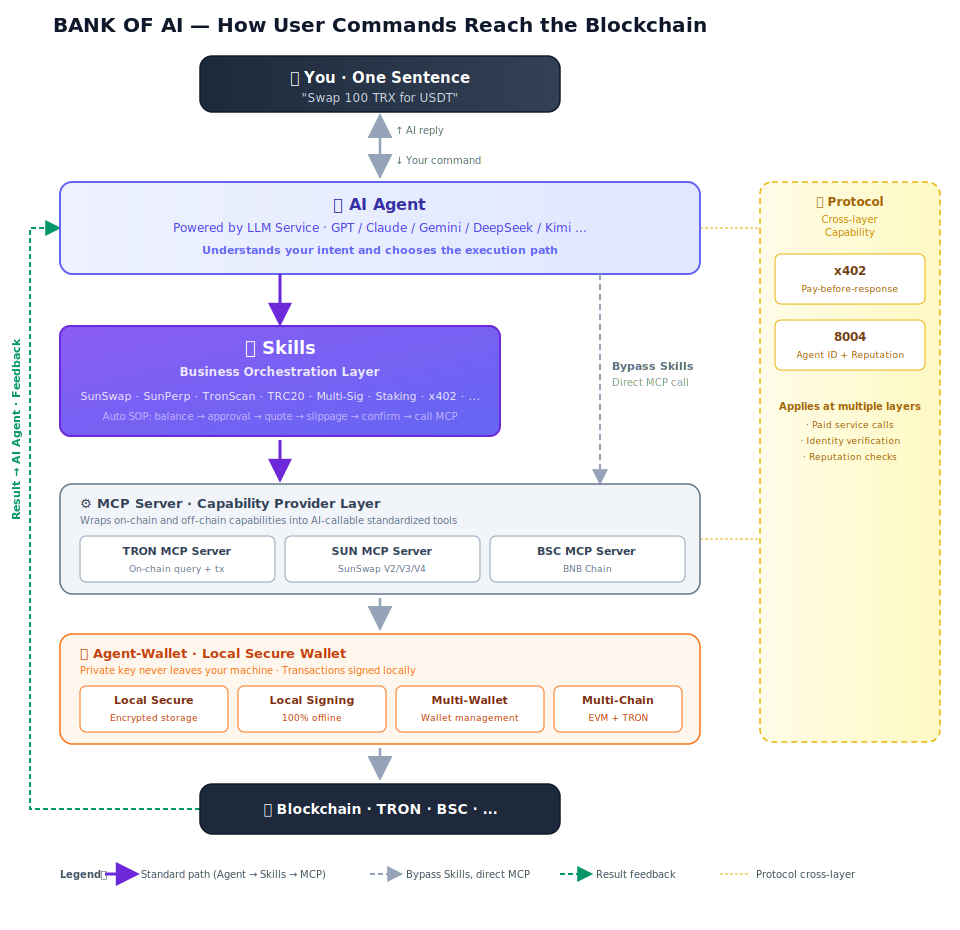

# Introduction

## BANK OF AI in One Sentence

**BANK OF AI is the infrastructure that gives AI real Web3 capabilities.**

Core positioning: **Your Web3 Gateway to AI.**

BANK OF AI gives your AI four core capabilities:

- 💸 **Payment** — pay in crypto (x402)
- 🪪 **Identity** — a verifiable on-chain identity and reputation (8004)
- ⚙️ **Action** — the full set of on-chain atomic capabilities, plus orchestration (Skills + MCP Server + Agent Wallet)
- 🧠 **Cognition** — one unified entry point to all leading LLMs (LLM Service)

You don't need to write code, switch wallets, or hop between multiple dApps — just hand the task to your AI, and BANK OF AI's full stack does the rest in the background.

---

## The BANK OF AI Product Matrix

BANK OF AI is made up of **4 layers**:

- **🧠 Model Layer | Top AI in One Account** — LLM Service (BANKOFAI APP + API Gateway), a single entry point to every leading LLM
- **🛤️ Protocol Layer | Payment. Verify. Build.** — x402 Payment · 8004 Protocol, two open protocols connecting AI and Web3
- **🔧 Tool Layer | Everything Your Agent Needs** — Agent Wallet · Skills · MCP Server, the full toolkit giving your AI on-chain signing, operational SOPs, and protocol wrappers
- **🌐 Ecosystem Layer | AI Agent Ecosystem** — Third-party MCP Servers and Skills across TRON / Ethereum / BNB Chain, all plugged into the same protocols

Each layer is usable on its own, or composable with the others — pick what you need.

---

## 🧠 Model Layer | Top AI in One Account

### LLM Service — A Unified Entry Point to Every Leading LLM

**LLM Service is BANK OF AI's model-access layer.** It aggregates GPT, Claude, Gemini, DeepSeek, Kimi, GLM, MiniMax, and other leading models under a single account, exposed two ways:

- **BANKOFAI APP** (the official app, corresponding to the `BANKOFAI APP →` button in the top-right of the website): an AI Chat app for end users — open [chat.bankofai.io/chat](https://chat.bankofai.io/chat) and use it directly, switch models on demand
- **API Gateway** (one API key for every model): a unified API for developers, billed by usage, OpenAI-compatible, usable from any OpenAI-compatible third-party AI client

**Key points**: fund with crypto (TRON / BNB Chain), pay-as-you-go, no card linking, no subscription.

👉 Learn more: [LLM Service Introduction](../llmservice/introduction.md)

---

## 🛤️ Protocol Layer | Payment. Verify. Build.

With the model layer in place, AI is still just a "brain." To let it spend on-chain and be verified, you first need two open protocols: **x402 defines how payments get made**, and **8004 defines who each Agent is.**

### 01 · x402 Payment — One Line of Code for On-chain Payments

**An open payment protocol built on an extension of HTTP `402 Payment Required`.** When AI calls a paid service, it automatically signs a small on-chain payment and instantly receives the content — no account, no credit card, no pre-funding.

- **Currently supports**: TRON, BNB Chain (more chains rolling out)
- **SDK components**: Client SDK · Server SDK · Facilitator

**Typical scenarios**:

- MCP Server calls a paid off-chain API
- The `x402-payment` Skill triggers payment explicitly
- An AI Agent autonomously decides to buy paid content
- **Agent-to-Agent auto-settlement** — pay-per-call between two AIs

> ⚙️ **Dependency**: The x402 SDK uses [Agent-Wallet](#03--agent-wallet--ais-local-signing-layer) to parse and manage wallet credentials — installing x402 pulls in agent-wallet automatically.

👉 Learn more: [x402 Protocol Introduction](../x402/index.md)

---

### 02 · 8004 Protocol — On-chain Identity and Reputation for AI Agents

**A Web3-native "Agent Registry + Reputation System."** Any Agent can mint an identity NFT on-chain, bind its service endpoints (Web / MCP / DID), and openly accept feedback from other Agents and users.

It solves one core question: **as AI Agents proliferate, how do you know which ones you can trust?**

- **Standard metadata**: name, capability claims, service endpoints
- **Verifiable credentials**: signatures + rotation policy
- **Chain support**: TRON · BNB Chain

**Typical uses**:

- An AI Agent checks a stranger's on-chain reputation before calling its service
- Skills orchestration runs a pre-flight risk check
- MCP Servers verify each other's identity
- Check a counterparty's reputation before paying or granting authorization

8004 is a **horizontal protocol** — any step that needs "identity verification" or "reputation lookup" can call it; it isn't tied to a specific layer.

👉 Learn more: [8004 Protocol Introduction](../8004/general.md)

---

## 🔧 Tool Layer | Everything Your Agent Needs

The protocol layer is in place — now AI needs tools to actually use those protocols. **A single `npx skills add` command** gives your AI on-chain signing (Agent Wallet), on-chain operation SOPs (Skills), and protocol wrappers (MCP Server) all at once — the three things an AI needs to perform any on-chain operation.

### 03 · Agent Wallet — AI's Local Signing Layer

**Agent Wallet is the AI Agent's local encrypted wallet**, providing unified signing for every Skill, MCP Server, and the x402 SDK.

Your private key is encrypted and locked in a hidden local directory; the AI only ever holds an unlock password. **Even if the password leaks, the encrypted file alone is useless. Even if the file is stolen, without the password it's just gibberish.**

- 🔒 **Encrypted storage**: Keystore encryption + `local_secure` mode, 100% local and offline
- 🔑 **Flexible import**: create new, or import from private key / mnemonic
- 🔄 **Multi-wallet switching**: manage multiple wallets and switch the active account any time
- ⛓️ **Multi-chain signing**: TRON + every EVM-compatible chain (Ethereum / BSC / Polygon / Base / Arbitrum…)

```bash
npm i @bankofai/agent-wallet
```

> 💡 **Who depends on Agent-Wallet**:
> - **x402 SDK** — parses payment credentials, signs x402 micropayments (pulled in automatically when x402 is installed)
> - **Skills** — whenever an on-chain operation needs a signature
> - **MCP Servers** (when self-hosted) — write-type tools read the local wallet before executing

**What users see**: when you first follow the [Quick Start](./QuickStart.md), Agent-Wallet is created and configured for you automatically — most users never touch it directly.

👉 Learn more: [Agent-Wallet Introduction](../Agent-Wallet/Intro.md)

---

### 04 · Skills — The SOP Playbook for AI On-chain Operations

**Skills are pre-written standard operating procedures for AI on-chain actions.** The AI Agent follows the Skill's SOP step by step — **check balance → check approval → fetch quote → apply slippage protection → wait for your confirmation → call MCP Server to execute** — nothing skipped, common pitfalls avoided.

Example: a user says "use 50 USDT to buy some TRX." A vanilla AI might generate a transaction that fails because USDT was never approved on SunSwap. An AI loaded with the `sunswap-dex-trading` Skill walks the full SOP automatically.

**BankOfAI Skills suite** (growing alongside the ecosystem):

| Skill | Covers |
| :-- | :-- |
| `agent-wallet` | Wallet management |
| `bankofai-guide` | Onboarding new users through setup |
| `sunswap-dex-trading` | SunSwap V2/V3/V4 swaps |
| `sunperp-perpetual-futures-trading` | SunPerp perpetual futures |
| `trc20-token-toolkit` | TRC20 token toolkit |
| `tronscan-data-lookup` | TronScan on-chain data lookup |
| `trx-staking-sr-voting` | TRX staking + SR voting |
| `usdd-just-protocol` | USDD / JUST protocol |
| `multi-sig-account-permissions` | TRON multi-sig and permissions |
| `x402-payment` | x402 payment |
| `recharge-skill` | BANK OF AI account top-up |

**Key properties**: one sentence installs every Skill; invoked in natural language; automatically calls the underlying MCP Server to execute atomic on-chain operations.

👉 Learn more: [Skills Introduction](../McpServer-Skills/SKILLS/Intro.md) · [Quick Start](./QuickStart.md)

---

### 05 · MCP Server — The On-chain Atomic Capability Interface

**MCP Server (Model Context Protocol Server)** is built on Anthropic's MCP standard. It wraps on-chain and off-chain capabilities into standardized, AI-callable tools.

**Relationship between Skills and MCP Server:**

| Layer | Role | Responsibility |
| :-- | :-- | :-- |
| **Skills** | Business Orchestration Layer | Stringing multi-step operations into SOPs, handling pre-checks and risk control |
| **MCP Server** | Capability Provider Layer | Exposing atomic capability tools for upper layers to call |

BANK OF AI officially ships three **MCP Servers**, all pointed at BANK OF AI's official cloud endpoints by default — ready to use out of the box:

- **TRON MCP Server** — atomic TRON on-chain operations (query, transfer, contracts, staking, governance), 60+ tools. Supports local private deployment
- **SUN MCP Server** — SunSwap V2/V3/V4 swap and liquidity capabilities, 20+ tools. Supports local private deployment. Also ships **[SUN CLI](../McpServer-Skills/Tools/SUNCli/Intro.md)** — a command-line implementation fully equivalent to SUN MCP Server's capabilities, for scripting / automation / CI-CD scenarios
- **BSC MCP Server** — atomic on-chain operations for BNB Chain

> 💡 **Private deployment**: Skills call MCP Server via the official cloud endpoints by default — no separate install needed. For local deployment, see each MCP Server's deployment guide.

> ⚙️ **Dependency**: A self-hosted MCP Server needs Agent-Wallet configured first — the wallet determines which identity the AI uses for on-chain actions. Without a wallet, write-type tools return an error.

Beyond BANK OF AI's official MCP Servers, the ecosystem has more third-party MCP Servers and Skills — see [🌐 Ecosystem Layer](#-ecosystem-layer--ai-agent-ecosystem) below.

👉 Learn more: [MCP Server Introduction](../McpServer-Skills/MCP/Intro.md)

---

## 🌐 Ecosystem Layer | AI Agent Ecosystem

Beyond BANK OF AI's own products, the ecosystem already includes several leading DeFi / data protocols across 3 chains — each shipping a **production-grade MCP Server or Skills** that AI can install and use immediately.

### 🔴 TRON

| Product | Provider | Capabilities | Install |
| :-- | :-- | :-- | :-- |
| **TRON MCP Server** | Bank of AI | Transfer / Contract / Staking / Governance, 60+ tools | `npx -y @bankofai/mcp-server-tron` |
| **SUN MCP Server** | Bank of AI | Swap / Liquidity / Farming, V2/V3/V4, 20+ tools | `npx -y @bankofai/sun-mcp-server` |
| **JustLend MCP Server** | JustLend DAO | Lend / Borrow / Staking / Governance, 50 tools | `npx -y @justlend/mcp-server-justlend` |
| **TronScan MCP Server** | TronScan | Query / Analytics / Security, 119 tools | `https://mcp.tronscan.org/mcp` |

### 🔵 Ethereum

| Product | Provider | Capabilities | Install |
| :-- | :-- | :-- | :-- |
| **Etherscan** | Etherscan Official | Query / Tracking / Analytics, 60+ chains | `npx skills add https://docs.etherscan.io` |
| **Uniswap AI** | Uniswap Labs | Swap / Liquidity / V4 Hooks / 5 Plugins | `npx skills add Uniswap/uniswap-ai` |

### 🟡 BNB Chain

| Product | Provider | Capabilities | Install |
| :-- | :-- | :-- | :-- |
| **BNB Chain** | BNB Chain Official | Transfer / Contract / Query / 8004 identity registry | `npx skills add bnb-chain/bnbchain-skills` |
| **PancakeSwap AI** | PancakeSwap Official | Swap / Liquidity / Farming, 3 Skills · 8 chains | `npx skills add pancakeswap/pancakeswap-ai` |
| **ListaDAO** | ListaDAO Official | Lending / Staking / CDP, 3 Skills · 9 MCP tools | `npx skills add lista-dao/lista-skills` |

> 💡 The ecosystem is expanding — refer to the official **[AI Agent Ecosystem](https://bankofai.io)** page for the latest list.

---

## How BANK OF AI Layers Work Together

The sections above covered what each of the 4 layers does. Below is what happens when they collaborate on a real operation — a **TRC20 transfer**, the most common case.

<div style={{ textAlign: 'center', margin: '1.5rem 0' }}>



</div>

**① Model Layer · Understanding Intent**

In any AI client (BANKOFAI APP / OpenClaw / Cursor / Claude Code / Codex / Telegram / …), you type a sentence:

> Transfer 100 TRX to address `T....XXXXX`

The AI client is powered by **LLM Service**, recognizes this as a TRC20 / TRX transfer, and decides to call the `trc20-token-toolkit` Skill.

**② Tool Layer · Skills Orchestration**

`trc20-token-toolkit` walks its SOP step by step: **check balance → validate the recipient address → build the transaction → wait for your confirmation.** If any step fails (insufficient balance, malformed address, etc.), it stops immediately and returns the reason.

**③ Tool Layer · MCP + Wallet · Build · Sign · Submit**

The Skill calls **TRON MCP Server** to assemble the TRC20 transfer, hands it to **Agent-Wallet** for local signing on your machine (**private keys never leave your computer**), and submits it to TRON Mainnet.

**④ Return · The result travels back to the AI Agent**

Once on-chain execution completes, the tx hash, status, and event logs travel back along the same path — MCP Server parses them into structured data, and the AI Agent turns that into a natural-language summary:

> ✅ Transferred 100 TRX to `T....XXXXX`. Fee: 1.1 TRX.
> Tx hash: `0xabc123...def456` ([view on TronScan](https://tronscan.org))

:::tip When do the other two layers engage?
This example only involves the **Model Layer** and **Tool Layer**. The other two kick in by scenario:

- **🛤️ Protocol Layer**: **x402** activates when a payment is involved (calling a paid API, subscribing to an Agent service, etc.); **8004** activates when verifying an unfamiliar Agent's identity or looking up its reputation
- **🌐 Ecosystem Layer**: when you need to go cross-chain or call a third-party protocol (e.g. swapping on Ethereum via **Uniswap AI**, staking on BNB Chain via **ListaDAO**), the AI Agent calls the corresponding third-party MCP Server / Skills — the flow is identical to this example, just with a different MCP Server at the target chain
:::

---

## Is BANK OF AI for Me?

- **Web3 beginner:** Absolutely. Paste one install command into your AI client, and everything else is configured automatically; from there, plain-language conversation is all you need — no underlying knowledge required.
- **Web3 veteran:** Skip the "switch wallet → copy address → calculate slippage → wait for blocks" grind. Let AI handle the repetitive work; you focus on strategy.
- **AI Agent developer:** Full SDKs, CLIs, APIs, and MCP-standard interfaces — build your own AI Agents on top of BANK OF AI, giving them on-chain capability and autonomous payment.
- **API service provider:** With x402, your paid APIs can be called by AI and billed per call automatically — no traditional account registration, no credit-card binding required. Especially well-suited for micropayments and agent-to-agent settlement.

---

## Ready?

Want your AI client to gain BANK OF AI's on-chain capabilities? Just **two steps**, under **1 minute**:

1. Paste one install command into your AI assistant — AI automatically installs every BANK OF AI Skill and the Agent Wallet CLI
2. Reply with a single **`A`** — AI automatically creates your local encrypted wallet

For standalone integration of **LLM Service / x402 / 8004**, or **local private deployment of MCP Server / using SUN CLI**, refer to each product's own docs.

👉 **[Go to Quick Start](./QuickStart.md)**
