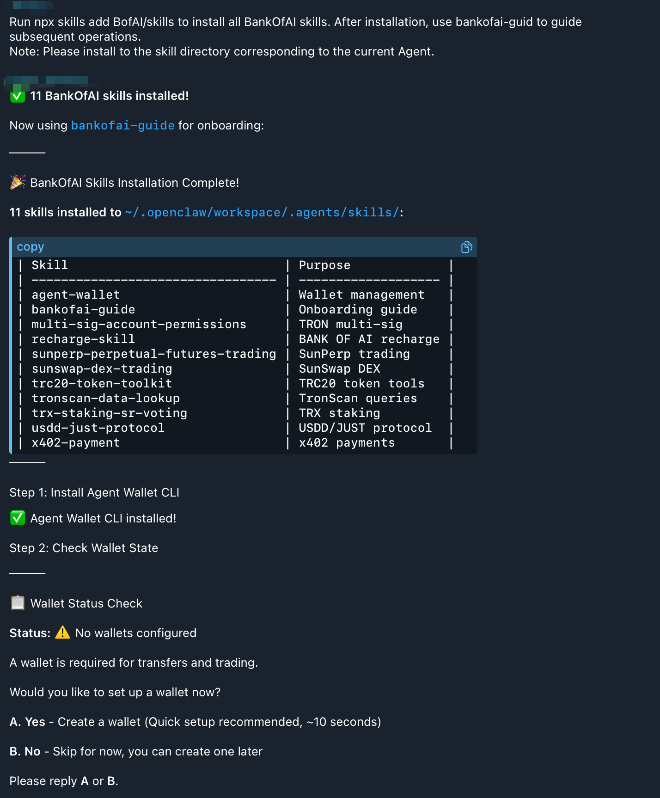

# Quick Start

Get your AI up and running with BANK OF AI SKILLS in **2 steps** and less than **1 minute**. No private keys, no configuration — just install and start talking.

---

## Step 1: Install the Skills

We provide three installation methods. **Pick the one that matches your level of comfort** — the conversational install is the easiest; the interactive install gives you the most control.

### Method 1: Conversational Install (Easiest)

If you're already using a Skills-compatible AI Agent (OpenClaw, a Telegram bot, web chat, or any client that supports running shell commands), you can install everything by **simply chatting with the AI** — no need to open a terminal yourself, no manual file copying.

:::tip Prerequisite
**Node.js is required** on the machine where the AI Agent runs (the Agent uses `npx` under the hood). If Node.js isn't installed yet, grab the LTS installer from [nodejs.org](https://nodejs.org) — install once, double-click and follow the prompts.
:::

**How it works:**

1. Open your AI Agent chat
2. Copy and paste the following prompt:

   ```
   Run npx skills add BofAI/skills to install all BANK OF AI skills. After installation, use bankofai-guide to guide subsequent operations.
   Note: Please install to the skill directory corresponding to the current Agent.
   ```

3. The AI handles the entire flow automatically:
   - Pulls the `BofAI/skills` repository
   - Detects your current Agent's skills directory (e.g. `~/.openclaw/workspace/.agents/skills/`)
   - Installs all 11 BANK OF AI skills (`agent-wallet`, `sunswap-dex-trading`, `x402-payment`, `bankofai-guide`, etc.)
   - Invokes the `bankofai-guide` skill to onboard you:
     - **Step 1**: Install the Agent Wallet CLI
     - **Step 2**: Check your wallet state
     - **Step 3**: If no wallet exists, prompt you to set one up (reply **A** = quick setup in ~10 seconds, reply **B** = skip for now and create later)

**Example dialog:**



Or in plain text, the response looks like:

```
> Run npx skills add BofAI/skills to install all BANK OF AI skills...

✅ 11 BANK OF AI skills installed!

Now using bankofai-guide for onboarding:

🎉 BANK OF AI Skills Installation Complete!

11 skills installed to ~/.openclaw/workspace/.agents/skills/:

| Skill                              | Purpose             |
|------------------------------------|---------------------|
| agent-wallet                       | Wallet management   |
| bankofai-guide                     | Onboarding guide    |
| multi-sig-account-permissions      | TRON multi-sig      |
| recharge-skill                     | BANK OF AI recharge |
| sunperp-perpetual-futures-trading  | SunPerp trading     |
| sunswap-dex-trading                | SunSwap DEX         |
| trc20-token-toolkit                | TRC20 token tools   |
| tronscan-data-lookup               | TronScan queries    |
| trx-staking-sr-voting              | TRX staking         |
| usdd-just-protocol                 | USDD/JUST protocol  |
| x402-payment                       | x402 payments       |

Step 1: Install Agent Wallet CLI
✅ Agent Wallet CLI installed!

Step 2: Check Wallet State

📋 Wallet Status Check
Status: ⚠️  No wallets configured

A wallet is required for transfers and trading.

Would you like to set up a wallet now?

A. Yes - Create a wallet (Quick setup recommended, ~10 seconds)
B. No  - Skip for now, you can create one later

Please reply A or B.
```

**After the prompt:**

- Reply `A` → the AI walks you through wallet creation (quick setup recommended, ~10 seconds)
- Reply `B` → skip for now; you can create one any time later

That's it — once the guide finishes, all skills are ready to use.

:::tip Why this is the recommended path for beginners
You don't need to know what `npx`, `npm`, or "global install" mean. The AI handles every step including selecting the right skills directory for your platform, installing the wallet CLI, and onboarding you to your first wallet.
:::

---

### Method 2: Quick Auto-Install (Command Line)

If you have Node.js installed and prefer the command line, simply tell your AI Agent to execute the following command:

```bash
npx skills add https://github.com/BofAI/skills -y -g
```

The `-y` flag skips all interactive prompts and installs all available Skills by default. The `-g` flag enables global installation (available across all projects). Once complete, it will show ✅ Global installation complete! along with the full list of installed Skills.

---

### Method 3: Interactive Install (Most Control)

If you want to choose which Skills to install and the installation scope, remove the `-y -g` flags:

```bash
npx skills add https://github.com/BofAI/skills
```

:::tip
This guide demonstrates the installation process using terminal commands as an example.
:::

#### Interactive Installation Walkthrough

The installer will guide you through a few steps — just follow along:

**1️⃣ Confirm tool installation**

Terminal will ask you to install the `skills` package. Type `y` and press Enter:

```
Need to install the following packages:
  skills@1.4.6
Ok to proceed? (y) y
```

**2️⃣ Select which Skills to install**

The installer automatically fetches all available Skills from the repo and lists them for selection. Press **Space** to toggle each one — we recommend selecting all:

```
◇  Found 8 skills
│
◇  Select skills to install (space to toggle)
│  agent-wallet, Multi-Sig & Account Permissions, recharge-skill,
│  SunPerp Perpetual Futures Trading, SunSwap DEX Trading,
│  TRC20 Token Toolkit, TronScan Data Lookup, x402-payment
```

:::tip Select all
Unless you're sure you only need specific skills, install them all. Skills use an on-demand architecture — unused skills consume zero resources.
:::

**3️⃣ Choose which AI tools to install to**

The installer auto-detects AI tools on your computer (e.g., Cursor, Claude Code, Cline, etc.). Use Space to select the ones you want:

```
◇  43 agents
◇  Which agents do you want to install to?
│  Amp, Antigravity, Cline, Codex, Cursor, Deep Agents,
│  Gemini CLI, GitHub Copilot, Kimi Code CLI, OpenCode, Warp
```

**4️⃣ Choose installation scope**

Select `Project` (current project only) or `User` (globally available across all projects):

```
◇  Installation scope
│  Project
```

**5️⃣ Review security assessment & confirm**

The installer runs a security scan on each Skill and shows the results. Review them and select `Yes` to proceed:

```
◇  Security Risk Assessments ──────────────────────────────────────╮
│                                                                  │
│                                    Gen         Socket     Snyk   │
│  agent-wallet                      Med Risk    1 alert    High Risk │
│  Multi-Sig & Account Permissions   --          --         --     │
│  recharge-skill                    Safe        1 alert    Med Risk │
│  SunPerp Perpetual Futures Trading --          --         --     │
│  SunSwap DEX Trading               --          --         --     │
│  TRC20 Token Toolkit               --          --         --     │
│  TronScan Data Lookup              --          --         --     │
│  x402-payment                      Safe        1 alert    Med Risk │
│                                                                  │
├──────────────────────────────────────────────────────────────────╯

◇  Proceed with installation?
│  Yes
```

**6️⃣ Installation complete!**

When you see output like this, all Skills have been successfully installed to your selected AI tools:

```
◇  Installed 8 skills ────────────────────────╮
│                                             │
│  ✓ agent-wallet (copied)                    │
│  ✓ Multi-Sig & Account Permissions (copied) │
│  ✓ recharge-skill (copied)                  │
│  ✓ SunPerp Perpetual Futures Trading (copied)│
│  ✓ SunSwap DEX Trading (copied)             │
│  ✓ TRC20 Token Toolkit (copied)             │
│  ✓ TronScan Data Lookup (copied)            │
│  ✓ x402-payment (copied)                    │
│                                             │
├─────────────────────────────────────────────╯

└  Done!
```

:::tip Optional: Install find-skills
After installation, you may be prompted to install `find-skills` — a helper that lets your AI automatically discover and suggest new skills. We recommend selecting `Yes`.
:::

### Verify Installation

Open your AI chat and type:

```
Read the sunswap skill and tell me what it can do.
```

If the AI accurately describes the skill's capabilities — congratulations, installation is complete!

---

## Step 2: Talk to Your AI

Open your AI chat and copy-paste any of these:

> Give me a TRON network overview: current TPS, number of Super Representatives, total accounts.

In seconds, the AI calls the tronscan-skill and returns a complete on-chain data report.

**This is completely safe — it's only "looking" at data. It doesn't touch your wallet or spend a single coin.**

Try a few more:

> How much TRX can I get for 100 USDT on SunSwap?

> Show me the top 10 TRC20 tokens by market cap.

> What's the current price, 24h change, and funding rate for BTC-USDT perpetual contract?

If the AI responds with real data — congratulations, your AI is up and running!

---

## 💰 Want the AI to Trade for You?

Everything above is "look but don't touch" — the AI can look up data and compare prices, but it doesn't have permission to spend a single coin of yours. That's by design: you stay in full control.

When you're ready to let the AI execute swaps, open positions, or manage liquidity, you need to give it a "wallet key."

We've prepared two ways to hand over the key — pick whichever suits you:

### Option 1: Open a Dedicated "Payment Account" for the AI (Strongly Recommended, Safest)

We recommend using **Agent Wallet**. Think of it as opening a dedicated payment account for your AI. You don't expose your bank password (plaintext private key) in a file on your computer — instead, you set an encryption password. Every time it wants to spend money, it shows you the full bill first and only proceeds after you say "yes."

👉 Head over to [Agent Wallet Quick Start](../../Agent-Wallet/QuickStart.md) to set it up (visual interface, about 2 minutes).

### Option 2: Paste Your Private Key Directly (For Power Users or Quick Testing)

If you don't want to install another tool and just want to start trading right away, you can paste your private key into a simple config file on your computer — like editing a notepad:

1. In Terminal (the black window), type `open -e ~/.zshrc` and press Enter.
2. A text editor window will pop up. Scroll to the very bottom, start a new line, and paste your TRON private key:
   ```bash
   export TRON_PRIVATE_KEY='your_real_or_testnet_private_key'
   ```
   ⚠️ Important: Don't forget the double quotes on both sides!
3. Press `Command + S` to save, then close the editor.

:::danger Critical Step
No matter which option you chose, you must **completely close and reopen your AI tool** for it to pick up the new key!
:::

---

## 🎮 Key Is Set — How Do I Start Trading?

Once you've configured your key and restarted your AI, you can start giving it trading commands right away!

:::caution Golden Rule for Beginners: Practice with Play Money First
Before running any real transaction, **always test on the Nile testnet first**. Testnet tokens have zero real-world value — you can experiment freely without risking anything.
:::

Open your AI chat and say your first trading command:

> Swap 100 TRX for USDT on the Nile testnet.

The AI will quickly calculate the price, estimate fees, then pause and ask: "Ready to execute?" Just reply "yes," and the on-chain transaction completes automatically!

Once you've practiced on testnet and confirmed the AI behaves exactly as expected, simply drop the words "Nile testnet" from your commands — and it will trade with real funds on mainnet.

---

## Next Steps

- See what each skill can do → [Skill Catalog](./BANKOFAISkill.md)
- Something not working? → [FAQ](./Faq.md)
