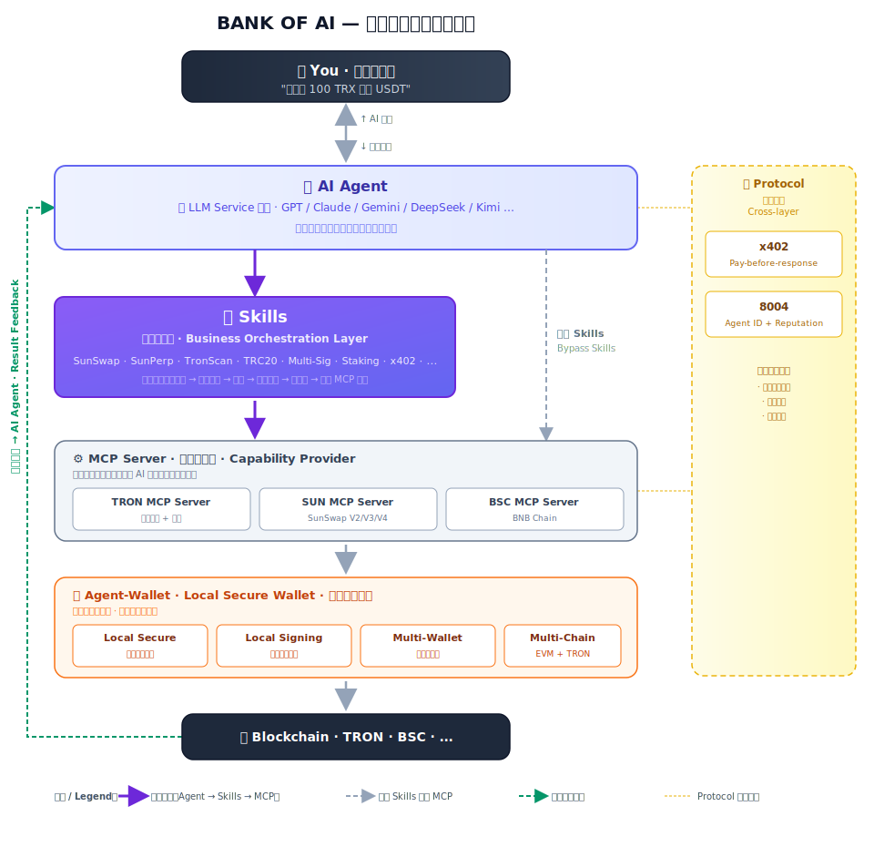

# 简介

## 一句话理解 BANK OF AI

**BANK OF AI —— Your Web3 Gateway to AI，你的 Web3 AI 门户。**

一个入口，让你的 AI 同时拥有 4 项核心能力：

- 💸 **付款能力**：会用加密货币付款（x402）
- 🪪 **身份能力**：拥有可验证的链上身份与信誉（8004）
- ⚙️ **行动能力**：调用完整的链上原子能力与编排（Skills + MCP Server + Agent Wallet）
- 🧠 **认知能力**：一号通享顶级大模型（LLM Service）

你不需要懂代码，不需要切钱包，不需要在多个 dApp 之间反复跳转——把任务交给 AI，BANK OF AI 替它接好支付、身份、行动与大脑。

---

## BANK OF AI 的产品矩阵

BANK OF AI 由 **4 层** 组成：

- **🧠 模型层 | Top AI in One Account** —— LLM Service（BANKOFAI APP + API Gateway），主流大模型的统一入口
- **🛤️ 协议层 | Payment. Verify. Build.** —— x402 Payment · 8004 Protocol，连接 AI 与 Web3 的两套开放协议
- **🔧 工具层 | Everything Your Agent Needs** —— Agent Wallet · Skills · MCP Server，让 AI 获得链上签名、操作 SOP 与协议封装的完整工具包
- **🌐 生态层 | AI Agent Ecosystem** —— 基于同一套协议开放接入的 TRON / Ethereum / BNB Chain 第三方 MCP Server 与 Skills

每一层都可以独立使用，也可以组合起来——按需取用。

---

## 🧠 模型层 | Top AI in One Account

### LLM Service — 主流大模型的统一入口

**LLM Service 是 BANK OF AI 的模型接入层**，把 GPT、Claude、Gemini、DeepSeek、Kimi、GLM、MiniMax 等主流大模型聚合到一个账户下，提供两种使用方式：

- **BANKOFAI APP**（官方应用，对应官网右上角 `BANKOFAI APP →` 按钮）：面向终端用户的 AI Chat 应用，打开 [chat.bankofai.io/chat](https://chat.bankofai.io/chat) 直接使用，随需切换模型
- **API Gateway**（一套 API Key 调所有模型）：面向开发者的统一 API，按用量计费，兼容 OpenAI 协议，可接入任意兼容 OpenAI 协议的第三方 AI 客户端

**核心特点**：加密货币充值（支持 TRON、BNB Chain、Ethereum、Base、Arbitrum、Optimism、Polygon）、按用量付费（Pay-as-you-go）、不绑卡、不订阅。

👉 详见：[LLM Service 简介](../llmservice/introduction.md)

---

## 🛤️ 协议层 | Payment. Verify. Build.

有了模型层，AI 还只是一个"大脑"——要让 AI 能在链上花钱、被验证，得先约定两套公开协议：**x402 解决钱怎么收**，**8004 解决 Agent 是谁**。

### 01 · x402 Payment — 一行代码接入链上支付

**基于 HTTP `402 Payment Required` 扩展的开放支付协议**——让 AI 在调用付费服务时自动在链上签一笔小额支付、立刻拿到内容，无需账号、无需信用卡、无需预充值。

- **当前支持**：TRON、BNB Chain（更多公链陆续接入）
- **SDK 组件**：Client SDK · Server SDK · Facilitator

**典型场景**：

- MCP Server 调用链下付费 API
- Skills 中的 `x402-payment` 显式发起支付
- AI Agent 自主决定购买付费内容
- **Agent 对 Agent 自动结算** —— 两个 AI 之间的按次计费

> ⚙️ **依赖关系**：x402 SDK 通过 [Agent-Wallet](#03--agent-wallet--ai-的本地签名层) 解析和管理钱包凭证——安装 x402 时会自动把 agent-wallet 作为依赖一起装上。

👉 详见：[x402 协议简介](../x402/index.md)

---

### 02 · 8004 Protocol — AI Agent 的链上身份与信誉

**Web3 上的「Agent 注册局 + 信誉系统」**——任何 Agent 都可以在链上铸造一个身份 NFT，绑定自己的服务端点（Web / MCP / DID），并公开接受其他 Agent 和用户的反馈。

它解决一个核心问题：**AI Agent 越来越多，你怎么知道某个 Agent 可不可信？**

- **标准元数据**：名称、能力声明、服务端点
- **可验证凭证**：签名 + 轮换策略
- **链支持**：TRON · BNB Chain

**典型用法**：

- AI Agent 调用陌生服务前，先查对方的链上征信
- Skills 编排中做前置风控校验
- MCP Server 之间互相验证身份
- 付费 / 授权之前查对方的信誉评级

8004 是**横向协议**——任何需要"验证身份"或"查信誉"的环节都可以调用，不绑定特定层。

👉 详见：[8004 协议简介](../8004/general.md)

---

## 🔧 工具层 | Everything Your Agent Needs

协议层搭好了，还差一套工具让 AI 真正把协议用起来。AI 完成任意链上操作，需要三件事：**链上签名（Agent Wallet）、链上操作 SOP（Skills）、链上协议封装（MCP Server）**。

### 03 · Agent Wallet — AI 的本地签名层

**Agent Wallet 是 AI Agent 的本地加密钱包**，为所有 Skills、MCP Server、x402 SDK 提供统一的签名能力。

私钥被加密锁在本地隐藏目录中，AI 只持有一个"解锁密码"。**即便密码泄漏，没有加密文件依然无法解密；即便文件被窃取，没有密码也只是一段无法解读的密文。**

- 🔒 **加密存储**：Keystore 加密 + `local_secure` 模式，100% 本地离线
- 🔑 **灵活导入**：新建、导入私钥或助记词
- 🔄 **多钱包切换**：管理多个钱包，随时切换活跃账户
- ⛓️ **多链签名**：TRON + 全部 EVM 兼容链（Ethereum / BSC / Polygon / Base / Arbitrum…）

> 💡 **谁在依赖 Agent-Wallet**：
> - **x402 SDK** —— 解析支付凭证、签发 x402 小额支付（安装 x402 时自动带入）
> - **Skills** —— 执行需要签名的链上操作时
> - **MCP Server** 私有化部署时 —— 写入类工具执行前读取本机钱包签名

**用户感知**：首次按 [快速开始](./QuickStart.md) 走一遍时，Agent-Wallet 会自动创建并配置好——大多数用户不需要单独接触它。

👉 详见：[Agent-Wallet 简介](../Agent-Wallet/Intro.md)

---

### 04 · Skills — AI 链上操作的 SOP 手册

**Skills 是一套预先编写好的 AI 链上操作标准作业流程。** AI Agent 按 Skills 的 SOP 逐步执行——**查余额 → 检查授权 → 报价 → 滑点保护 → 等你确认 → 调用 MCP Server 执行**，一步不漏，规避常见陷阱。

举例：用户说"花 50 USDT 买点 TRX"。没装 Skills 的 AI 可能直接生成一段交易代码，因未授权 SunSwap 而报错；装了 `sunswap-dex-trading` Skill 的 AI 会严格按 SOP 自动完成所有前置与确认步骤。

**关键特性**：一句话安装全部 Skills；自然语言调用；自动调用下层 MCP Server 完成链上原子操作。BANK OF AI Skills 套件覆盖钱包管理、SunSwap 兑换、SunPerp 永续、TRC20 工具、TronScan 查询、TRX 质押投票、USDD/JUST、多签权限、x402 支付等场景，并随生态持续扩展。

👉 详见：[Skills 简介](../McpServer-Skills/SKILLS/Intro.md) · [快速开始](./QuickStart.md)

---

### 05 · MCP Server — 链上原子能力接口层

**MCP Server（Model Context Protocol Server）** 基于 Anthropic 的 MCP 标准，把链上与链下能力封装成 AI 可调用的标准化工具。

**Skills 与 MCP Server 的关系：**

| 层 | 角色 | 负责什么 |
| :-- | :-- | :-- |
| **Skills** | 业务编排层（Orchestration） | 把多步操作按 SOP 串起来，处理前置检查和风控 |
| **MCP Server** | 能力提供层（Capability Provider） | 提供原子能力工具给上层调用 |

BANK OF AI 提供两套 **MCP Server**，默认接入 BANK OF AI 云服务端点，开箱即用：

- **TRON MCP Server** — TRON 链上原子操作（查询、转账、合约、质押、治理），60+ 工具。支持本地私有化部署
- **SUN MCP Server** — SunSwap V2/V3/V4 兑换与流动性，20+ 工具。支持本地私有化部署。另提供 **[SUN CLI](../McpServer-Skills/Tools/SUNCli/Intro.md)**——与 SUN MCP Server 能力完全对等的命令行实现，面向脚本 / 自动化 / CI-CD 场景

> 💡 **私有化部署**：Skills 默认通过官方云端点调用 MCP Server，无需单独安装；若需本地部署，参考对应 MCP Server 的部署文档。

> ⚙️ **依赖关系**：MCP Server 私有化部署时需先配置 Agent-Wallet——钱包决定了 AI 以哪个身份执行链上操作。若未配置钱包，写入类工具执行时会返回错误提示。

除了 BANK OF AI 自研的 MCP Server，生态中还有更多第三方 MCP Server 和 Skills，见下方 [🌐 生态层](#-生态层--ai-agent-ecosystem)。

👉 详见：[MCP Server 简介](../McpServer-Skills/MCP/Intro.md)

---

## 🌐 生态层 | AI Agent Ecosystem

除了 BANK OF AI 自研的产品，整个生态已接入跨 3 条链的多个主流 DeFi / 数据协议——每一家都提供**生产级的 MCP Server 或 Skills**，AI 安装后立即能用。

### 🔴 TRON

| 产品 | 提供方 | 覆盖能力 | 安装 |
| :-- | :-- | :-- | :-- |
| **TRON MCP Server** | BANK OF AI | Transfer / Contract / Staking / Governance，60+ 工具 | `npx -y @bankofai/mcp-server-tron` |
| **SUN MCP Server** | BANK OF AI | Swap / Liquidity / Farming，V2/V3/V4，20+ 工具 | `npx -y @bankofai/sun-mcp-server` |
| **JustLend MCP Server** | JustLend DAO | Lend / Borrow / Staking / Governance，50 工具 | `npx -y @justlend/mcp-server-justlend` |
| **TronScan MCP Server** | TronScan | Query / Analytics / Security，119 工具 | `https://mcp.tronscan.org/mcp` |

### 🔵 Ethereum

| 产品 | 提供方 | 覆盖能力 | 安装 |
| :-- | :-- | :-- | :-- |
| **Etherscan** | Etherscan Official | Query / Tracking / Analytics，60+ 链 | `npx skills add https://docs.etherscan.io` |
| **Uniswap AI** | Uniswap Labs | Swap / Liquidity / V4 Hooks / 5 Plugins | `npx skills add Uniswap/uniswap-ai` |

### 🟡 BNB Chain

| 产品 | 提供方 | 覆盖能力 | 安装 |
| :-- | :-- | :-- | :-- |
| **BNB Chain** | BNB Chain Official | Transfer / Contract / Query / 8004 身份注册 | `npx skills add bnb-chain/bnbchain-skills` |
| **PancakeSwap AI** | PancakeSwap Official | Swap / Liquidity / Farming，3 Skills · 8 链 | `npx skills add pancakeswap/pancakeswap-ai` |
| **ListaDAO** | ListaDAO Official | Lending / Staking / CDP，3 Skills · 9 MCP 工具 | `npx skills add lista-dao/lista-skills` |

> 💡 生态持续扩张中，以官网 **[AI Agent Ecosystem](https://bankofai.io)** 为准。

---

## BANK OF AI 的协作流程

前面介绍了 4 层各自的分工——下面看它们在一次真实操作中如何协作。用 **TRC20 转账** 这个最常见场景举例。

**① 模型层 · 理解意图**

你在任意 AI 客户端（OpenClaw / Cursor / Claude Code / Codex 等）里发一句话：

> 向地址 `T....XXXXX` 转 100 TRX

AI 客户端由 **LLM Service** 驱动，识别出这是一笔 TRC20 / TRX 转账，决定调用 `trc20-token-toolkit` 这个 Skill。

**② 工具层 · Skills 编排**

`trc20-token-toolkit` 按 SOP 逐步推进：**查余额 → 校验收款地址 → 构造交易 → 等你确认**。任何一步不通过（余额不足、地址格式错等）都会立即停下并把原因返回给你。

**③ 工具层 · MCP + Wallet · 构造 · 签名 · 上链**

Skill 调用 **TRON MCP Server** 组装这笔 TRC20 转账交易，然后交给 **Agent-Wallet** 在你本机本地完成签名（**私钥永不出本机**），最后提交到 TRON 主网。

**④ 返回 · 结果沿原路径回到 AI 智能体**

链上执行完成后，交易哈希、状态、事件日志沿原路径反向返回——MCP Server 解析成结构化数据，AI 智能体再生成自然语言摘要：

> ✅ 已向 `T....XXXXX` 转账 100 TRX。手续费 1.1 TRX。
> 交易哈希：`0xabc123...def456`（[在 TronScan 查看](https://tronscan.org)）

:::tip 另外两层什么时候登场？
本例只涉及 **模型层** 和 **工具层**。其他两层按场景触发：

- **🛤️ 协议层**：**涉及付费**时（调用付费 API、订阅 Agent 服务等）走 **x402**；**验证陌生 Agent 身份或查信誉**时走 **8004**
- **🌐 生态层**：当你需要调用第三方协议（如 **Uniswap AI** 在以太坊兑换、**ListaDAO** 在 BNB Chain 质押）时，AI 智能体会调用对应的第三方 MCP Server / Skills——流程与本例一致，只是把 TRON MCP 换成目标链的 MCP Server
:::

---

## 我适合用 BANK OF AI 吗？

- **Web3 新手：** 完全没问题。把一段安装指令粘贴给 AI 客户端，剩下的全部自动完成；之后用自然语言对话即可，无需了解底层细节。
- **Web3 老手：** 可以告别「切钱包 + 复制地址 + 算滑点 + 等区块」的繁琐流程，让 AI 接管所有重复性工作，自己专注策略。
- **AI Agent 开发者：** 完整的 SDK、CLI、API 和 MCP 标准接口——你可以基于 BANK OF AI 构建自己的 AI Agent，让 Agent 拥有链上能力和自动支付能力。
- **API 服务提供方：** x402 协议让你的付费 API 被 AI 自动调用并按次计费，不需要传统账号注册、信用卡绑定流程，特别适合微支付和 Agent 对 Agent 自动结算场景。

---

## 准备好了吗？

想让你的 AI 客户端拥有 BANK OF AI 链上能力，只需**两步**，不到 **1 分钟**：

1. **粘贴安装指令** → AI 自动完成 Skills 安装 + 检查钱包状态，询问是否创建钱包
2. **确认创建钱包** → AI 自动创建本地加密钱包

如需独立接入 **LLM Service / x402 / 8004** 或对 MCP Server 做**本地私有化部署 / 使用 SUN CLI**，请参考对应产品的文档。

👉 **[前往快速开始](./QuickStart.md)**
