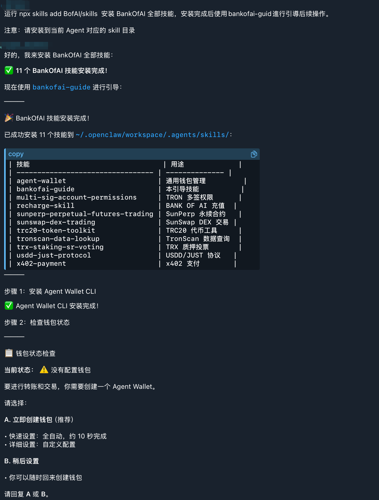

# 快速开始

只需 **2 步**，不到 **1 分钟**，你的 AI 就能开始帮你查链上数据、看行情报价。不需要密码，不需要配置任何东西——装完就能用。

---

## 第 1 步：安装技能库

我们提供了三种安装方式。**根据你的使用习惯选一种即可**——对话式安装最简单；交互式安装控制最精细。

### 方式一：对话式安装（最简单）

如果你已经在使用支持 Skills 的 AI Agent（OpenClaw、Telegram Bot、Web 聊天页面，或任何能执行 shell 命令的客户端），你可以**直接在对话框里让 AI 完成安装**——不用自己打开终端，不用手动复制文件。

:::tip 前置依赖
**需要在 AI Agent 运行的机器上安装 Node.js**（Agent 内部会调用 `npx`）。如果还没装，去 [nodejs.org](https://nodejs.org) 下载 LTS 安装包，双击按提示装一次即可，后续无需再操作。
:::

**操作步骤：**

1. 打开你的 AI Agent 对话框
2. 复制下面这段 prompt 发送给 AI：

   ```
   运行 npx skills add BofAI/skills 安装 BANK OF AI 全部技能，安装完成后使用 bankofai-guide 进行引导后续操作。
   注意：请安装到当前 Agent 对应的 skill 目录
   ```

3. AI 会自动完成以下流程（无需人工干预）：
   - 拉取 `BofAI/skills` 仓库
   - 自动检测当前 Agent 对应的 skills 目录（如 `~/.openclaw/workspace/.agents/skills/`）
   - 安装全部 11 个 BANK OF AI 技能（`agent-wallet`、`sunswap-dex-trading`、`x402-payment`、`bankofai-guide` 等）
   - 调用 `bankofai-guide` 技能进行引导：
     - **步骤 1**：安装 Agent Wallet CLI
     - **步骤 2**：检查钱包状态
     - **步骤 3**：如果还没有钱包，引导你立即创建（选项 **A** = 自动快速设置，约 10 秒；选项 **B** = 稍后设置）

**示例对话：**



或者纯文本展示，AI 的回复大致如下：

```
> 运行 npx skills add BofAI/skills 安装 BANK OF AI 全部技能...

✅ 11 个 BANK OF AI 技能安装完成！

🎉 BANK OF AI 技能安装完成！

已成功安装 11 个技能到 ~/.openclaw/workspace/.agents/skills/：

| 技能                              | 用途              |
|-----------------------------------|-------------------|
| agent-wallet                      | 通用钱包管理      |
| bankofai-guide                    | 本引导技能        |
| multi-sig-account-permissions     | TRON 多签权限     |
| recharge-skill                    | BANK OF AI 充值   |
| sunperp-perpetual-futures-trading | SunPerp 永续合约  |
| sunswap-dex-trading               | SunSwap DEX 交易  |
| trc20-token-toolkit               | TRC20 代币工具    |
| tronscan-data-lookup              | TronScan 数据查询 |
| trx-staking-sr-voting             | TRX 质押投票      |
| usdd-just-protocol                | USDD/JUST 协议    |
| x402-payment                      | x402 支付         |

步骤 1: 安装 Agent Wallet CLI
✅ Agent Wallet CLI 安装完成！

步骤 2: 检查钱包状态

📋 钱包状态检查
当前状态：⚠️ 没有配置钱包

要进行转账和交易，你需要创建一个 Agent Wallet。

请选择：

A. 立即创建钱包（推荐）
   • 快速设置：全自动，约 10 秒完成
   • 详细设置：自定义配置

B. 稍后设置
   • 你可以随时回来创建钱包

请回复 A 或 B。
```

**完成后选择：**

- 输入 `A` → AI 引导你完成钱包创建（自动或自定义）
- 输入 `B` → 跳过钱包配置，需要时再回来创建

引导走完后，所有技能即可正常使用。

:::tip 这是新手最推荐的路径
你不需要懂 `npx`、`npm` 是什么，也不用关心"全局安装"是什么意思。AI 会处理每一步，包括为你的平台选对 skills 目录、安装钱包 CLI、引导你完成首个钱包配置。
:::

---

### 方式二：一键自动安装（命令行）

如果你已经装好 Node.js 并习惯使用命令行，告诉你的 AI Agent 执行以下命令：

```bash
npx skills add https://github.com/BofAI/skills -y -g
```

`-y` 参数会跳过所有交互选择，默认安装所有 Skills；`-g` 参数表示全局安装（所有项目都可使用）。安装完成后会显示 ✅ 全局安装完成！以及安装的所有 Skills 列表。

---

### 方式三：交互式安装（最精细控制）

如果你想手动选择安装哪些 Skills 以及安装范围，去掉 `-y -g` 参数即可：

```bash
npx skills add https://github.com/BofAI/skills
```

:::tip 提示
本文档以在终端中运行命令为例展示安装过程。
:::

#### 交互式安装步骤详解

安装器会引导你完成以下几步，照着做就行：

**1️⃣ 确认安装工具**

终端会提示你需要安装 `skills` 工具包，输入 `y` 并回车即可：

```
Need to install the following packages:
  skills@1.4.6
Ok to proceed? (y) y
```

**2️⃣ 选择要安装的 Skills**

安装器会自动从仓库拉取所有可用的 Skills，然后列出清单让你勾选。按**空格键**切换选中/取消，默认全选即可：

```
◇  Found 8 skills
│
◇  Select skills to install (space to toggle)
│  agent-wallet, Multi-Sig & Account Permissions, recharge-skill,
│  SunPerp Perpetual Futures Trading, SunSwap DEX Trading,
│  TRC20 Token Toolkit, TronScan Data Lookup, x402-payment
```

:::tip 建议全选
除非你很明确只需要某几个技能，否则建议全部安装。Skills 采用按需唤醒架构，不用的技能不会占用任何资源。
:::

**3️⃣ 选择要安装到哪些 AI 工具**

安装器会自动检测你电脑上装了哪些 AI 工具（如 Cursor、Claude Code、Cline 等），用空格键勾选你要用的：

```
◇  43 agents
◇  Which agents do you want to install to?
│  Amp, Antigravity, Cline, Codex, Cursor, Deep Agents,
│  Gemini CLI, GitHub Copilot, Kimi Code CLI, OpenCode, Warp
```

**4️⃣ 选择安装范围**

选择 `Project`（当前项目）或 `User`（所有项目全局可用），按需选择即可：

```
◇  Installation scope
│  Project
```

**5️⃣ 查看安全评估 & 确认安装**

安装器会对每个 Skill 进行安全风险扫描，并展示评估结果。确认无误后选择 `Yes` 开始安装：

```
◇  Security Risk Assessments ──────────────────────────────────────╮
│                                                                  │
│                                    Gen         Socket     Snyk   │
│  agent-wallet                      Med Risk    1 alert    High Risk │
│  Multi-Sig & Account Permissions   --          --         --     │
│  recharge-skill                    Safe        1 alert    Med Risk │
│  SunPerp Perpetual Futures Trading --          --         --     │
│  SunSwap DEX Trading               --          --         --     │
│  TRC20 Token Toolkit               --          --         --     │
│  TronScan Data Lookup              --          --         --     │
│  x402-payment                      Safe        1 alert    Med Risk │
│                                                                  │
├──────────────────────────────────────────────────────────────────╯

◇  Proceed with installation?
│  Yes
```

**6️⃣ 安装完成！**

看到类似以下输出，说明所有 Skills 已经成功安装到你选择的 AI 工具中：

```
◇  Installed 8 skills ────────────────────────╮
│                                             │
│  ✓ agent-wallet (copied)                    │
│  ✓ Multi-Sig & Account Permissions (copied) │
│  ✓ recharge-skill (copied)                  │
│  ✓ SunPerp Perpetual Futures Trading (copied)│
│  ✓ SunSwap DEX Trading (copied)             │
│  ✓ TRC20 Token Toolkit (copied)             │
│  ✓ TronScan Data Lookup (copied)            │
│  ✓ x402-payment (copied)                    │
│                                             │
├─────────────────────────────────────────────╯

└  Done!
```

:::tip 可选：安装 find-skills
安装完成后，工具可能会提示你是否安装 `find-skills`——这是一个帮 AI 自动发现和推荐新技能的辅助工具，建议选 `Yes`。
:::

### 验证安装

打开你的 AI 对话框，输入：

```
读一下 sunswap 技能，告诉我它能做什么。
```

AI 能准确描述功能——恭喜，安装成功！

---

## 第 2 步：对 AI 说出你的第一句话

打开你的 AI 对话框，把下面这句话复制进去，回车：

> 给我一份 TRON 全网概览：当前 TPS、超级代表数量、账户总数。

几秒后，AI 会自动调用 tronscan-skill，为你呈现一份完整的链上数据报告。

**这个操作绝对安全——它只是帮你"看"数据，不碰你的钱包，不花一分钱。**

再试几句：

> 100 USDT 在 SunSwap 上能换多少 TRX？

> 显示市值排名前 10 的 TRC20 代币。

> BTC-USDT 永续合约的当前价格、24h 涨跌幅和资金费率是多少？

如果 AI 返回了真实数据——恭喜，你的 AI 已经"开窍"了！

---

## 💰 想让 AI 帮你交易？

上面所有的操作都是"只看不动"的——AI 能帮你查数据、比价格，但它现在还没有权限动你的一分钱。这是故意的：控制权始终在你手里。

当你准备好让 AI 帮你换币、开仓、管理流动性时，你需要给它配一把"钱包钥匙"。

我们为你准备了两种给钥匙的方法，任选其一即可：

### 方案一：给 AI 开个专用"支付宝"（强烈推荐，最安全）

我们推荐使用 **Agent Wallet**。你可以把它理解成给 AI 开了一个专属的支付账户。你不需要把银行卡密码（明文私钥）直接暴露在电脑文件里，而是给它设置一个支付密码。每次花钱前，它都会把账单摊开给你看，你说"好"它才会操作。

👉 前往 [Agent Wallet 快速开始](../../Agent-Wallet/QuickStart.md) 设置（有可视化界面，大约 2 分钟搞定）。

### 方案二：直接把私钥贴给 AI（适合老手或快速测试）

如果你嫌麻烦，不想装新工具，只想马上体验交易，你也可以像改普通记事本一样，直接把你的私钥贴在电脑的"隐形便签"里：

1. 在终端（黑框框）输入 `open -e ~/.zshrc` 并按回车。
2. 电脑会弹出一个记事本窗口。滑到最底下，新起一行，把你的波场私钥粘贴进去：
   ```bash
   export TRON_PRIVATE_KEY='你的真实或测试网私钥'
   ```
   ⚠️ 注意：两边的英文单引号千万别漏掉！
3. 按 `Command + S` 保存，关掉记事本。

:::danger 极其重要的一步
无论你用哪种方案配好了钥匙，都必须**彻底关闭并重新打开你的 AI 软件**，它才能拿到这把新钥匙！
:::

---

## 🎮 钥匙配好了，怎么让它去交易？

配好钥匙并重启 AI 后，你就可以直接对它下达交易指令了！

:::caution 新手铁律：先用假钱练手
在执行任何真实交易之前，**务必先在 Nile 测试网上跑一遍**。测试网用的是没有真实价值的"游戏币"，怎么折腾都不会亏钱。
:::

打开对话框，对 AI 喊出你的第一句交易指令：

> 在 Nile 测试网上，帮我把 100 TRX 兑换成 USDT。

此时，AI 会迅速帮你计算价格、预估手续费，然后停下来问你："确定要执行吗？" 你只需要回复"确定"，这笔链上交易就自动完成了！

等你在测试网上玩熟了，确认 AI 的表现完全符合预期，以后只要把指令里的"测试网"三个字去掉，它就会帮你操作主网的真金白银了。

---

## 下一步

- 看看每个技能都能帮你干什么 → [技能大全](./BANKOFAISkill.md)
- 遇到问题了？ → [常见问题](./Faq.md)
